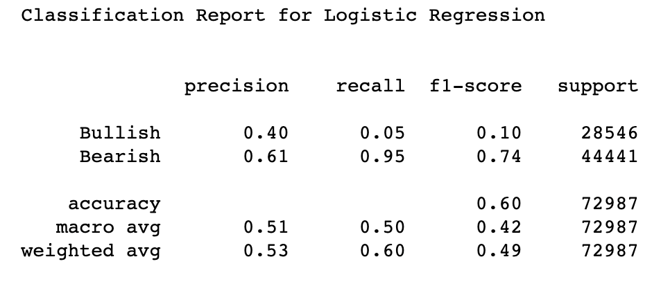

# Welcome to the project page financial_stock_ml.github.io.

### Group 3: Bullish Big Horns

# Project ML Bullish Stock Trends Platform
## Theme: Financial - Stock Market

### Abstract
Stock price fluctuation can be influenced by a variety of factors that makes prediction incredibly difficult. There have been many previous attempts to use classical regression methods or optimization techniques in short-term analysis. In our project, we will be combining both social media sentiment and stock metrics to forecast stock trends. We will utilize natural language processing to derive sentiment from Twitter and Reddit, web scraping to gather financial data from both YahooFinance and the SEC, and finally combining those two in a neural network to accurately predict stock value and the bullish/bearish nature of the stock. Using these techniques, we expect our models to forecast stock trends with ideally over a 75% accuracy rate.

### Introduction/Background
We are currently in volatile times for our economy.  Many companies have experienced massive shifts in the way they operate, which in turn has affected their stock prices. In addition, the Biden Administration's focus on Antitrust legislation for big tech companies which has also affected the stock trading indices. Most recently, stock prices for companies such as GameStop and AMC have risen due to Reddit user sentiment.

Stock price prediction is not a new concept. Traditionally, these predictions have relied almost solely on past trends, information from financial reports, and fundamental data. These numbers are then plugged into a variety of formulas to predict future prices. In contrast, not much work has been done with analyzing social media and other 'unofficial' channels for information, though, in recent years, there has been interest in utilizing sentiment analysis, particularly Twitter and Reddit sentiment analysis, to predict stock prices.

### Problem Definition
We aim to implement three models. The first model involves stock sentiment data input from Twitter, Reddit, and social media websites to predict daily stock trends using classification models. For this model we are assuming the tweets/posts are from direct market influencers, and thus popular posts that directly affect stock movements. The second model will focus on stock prices web-scraped from websites like Yahoo Finance and the Securities and Exchange Commission (SEC) to output regression models which indicate the trend of a stock. Since we are taking data from multiple company stocks, we are assuming that they are independent events for this model. Lastly, we will then use the two outputs (stock trend predictions from the regressors and classifiers), and use a Neural Network to predict the overall trends of a particular stock based on the optimal combination of the two algorithms. The assumption that justifies the use of this Neural Network is that there is some level of independence between the stock sentiment and the fundamentals and financial data, despite the mostly positive/negative correlations between different features of financial data and stock sentiment.

### Data Collection
We collected our input data from four different sources: Twitter and Reddit for stock sentiment, the SEC for financial data, and Yahoo Finance for stock price data. 

SEC: 
We used the BeautifulSoup library to web scrape from different SEC filings. To get the data from these SEC filings, we converted the files to .csv files with the help of Excel tools. Once we got the .csv files, we used a BeautifulSoup object to read the data and organize it into a data frame. After a bit of experimentation and trial-and-error, this was the most consistent way to scrape data and clean it. Below is a snapshot of the organized data in dictionaries.

#### Financial Data Picture

The focus is on the Cash Flow Statements since it provides a consolidation of the other two financial statements: The Balance Sheet and the Income Statement. Different filings show different time spans; the 10-Ks, for example, shows annual data, and the 10-Q's show the quarterly data, where the first quarter begins at the end of the month of December. The data spans for over 90 days, or three months, per quarter, aligned with the stock performance. Our data samples span back to 2014, so we were able to obtain and organize data into at least approximately 24 samples. Some features we used are the change in net income, cash operations, investments, financials, and change in cash equivalents. While technical analysis and graph theory were considered to be another solution, it was not a viable solution given the time frame of this project. Below is a picture of the AAPL Quarterly Data data frame.

Reddit:
Reddit is easy to scrape and developer-convenient compared to many other social media platforms where API call rate limiting does not apply to Reddit. However, to use the PRAW (Python Reddit API Wrapper) library, Reddit requires developers to create a “project” under Reddit Apps to obtain “client-id” and “client secret.” Once necessary information was obtained for the PRAW object, we immediately branched into a SubReddit called “wallstreetbets” and scraped the date, comments, upvotes, downvotes, and several other features from the top 50 “hot topics.” Although we could obtain around 10,000 data points, some of the comments are irrelevant, resulting in a shrinkage of data points. Therefore, we decided to increase the number of Subreddits and the number of hot topics to scrape. After collecting the data from Reddit, we filtered out punctuation using regex and stop-words using the NLTK stop-words package to make analysis easier. In addition, we applied VADER scores on the text data to convert the text into numerical scores based on whether the text had a negative, positive, or neutral sentiment.
 
Twitter:
Twitter posts were scraped using the TWINT library. A limit of 50,000 tweets was set, as well as a date limit dating back to 2010. Whichever limit is achieved first, the tweet scraping stops. We could have enabled scraping to date back further in time and obtain more tweet data. However, due to our assumption of tweets having a direct impact on stock movements, we valued more recent tweets. A language constraint was also set to only English tweets so that we can understand whether or not the algorithm is performing as expected. The data obtained would be the tweets, number of replies, likes, and retweets. We further cleaned the text by removing stop words such as “an,” “the,” etc., and we also kept all numerical and alphabetical data using regular expressions. We also applied to stem to our somewhat cleaned data. Then we applied VADER scores on the text data to convert the text into numerical scores based on whether the text had a negative, positive, or neutral sentiment.. The independent features were the number of replies, retweets, and likes, as well as the VADER scores, and our dependent variable, which is our output, is the daily percent change of the given stock. A positive percent change is BULLISH, and a negative percent change is BEARISH.
 
YahooFinance: 
We used the yfinance library to gather the stock prices from December 2014 to September 2020 from YahooFinance. We chose these particular dates so that they can match the dates we used to get the quarterly financial data from the SEC. Then we found the average stock price at close per quarter. This was put into a Pandas data frame sorted by quarterly dates to find the stock price change between the start and end of each quarter. 

### Methods
The baseline is each individual algorithm in itself. The baseline threshold to beat is 75% accuracy. Our method combines the best two classification algorithms of popular posts who influence the market through public platforms, such as Reddit and Twitter, with the best two regression algorithms that analyze fundamental financial data. The combination of the two algorithms is done through a LSTM (Long-Short-Term-Memory) Recurrent Neural Network which trains based on the output of the optimal regressors and classifiers to predict the stock trend.

We will be using supervised learning algorithms to create our dataset, pre-process the data and parse it, and predict future stock trends in the financial markets. Algorithms will include Natural Language Processing (NLP), Long-Short-Term-Memory (LSTM) Recurrent Neural Network, Logistic Regression (LR), Gaussian Naive Bayes (GNB), Bernoulli Naive Bayes (BNB), K-Nearest Neighbors (KNN), Support Vector Machine (SVM), Decision Tree Classification (DTC), Random Forest Classifiers (RFC), Linear Regression, Polynomial Regression (PR), Support Vector Regression (SVR), Decision Tree Regression (DTR), and Random Forest Regression (RFR). The sentiment data will be obtained from twitter and reddit posts using the twint and praw libraries. The financial metrics of U.S. publicly traded companies will be obtained using the Yahoo Finance (YFinance) and U.S. Securities and Exchange Commission APIs.

Our method incorporates text VADER scores as well as number or replies, retweets, reshares, likes, etc. depending on whether the platform is Reddit or Twitter. The classification models are trained on such datasets and predict corresponding daily stock trends. In addition to the classification algorithm, we included Fundamental Stock analysis based on SEC scraped quarterly financial data. This is novel as usually the NLP and classification algorithms are separated from the continuous regression models since the data usually does not coincide. However, our team found a way to combine both continuous data using regression models and discrete data using classification models with the hopes to achieve a better performance score in predicting a stock’s future trend. We applied the same procedure for data scraped from the Reddit platform.

To optimize our method of combining each individual algorithm and their respective parameters, we applied K-Fold Cross Validation and Grid Search. The best two performing classifier and regressor algorithms were chosen and merged into a single dataframe in which the LSTM Recurrent Neural Network was trained on the output of each model and predicting the corresponding quarterly stock trend.

### Metrics
Some metrics we used include the Accuracy score and Root Mean Squared Error (RMSE), as shown below, in the LSTM Recurrent Neural Network that would predict trends in the stock prices based on fundamental financial data. We also used the Adjusted R^2 score for other regression models.

In addition, we trained the LSTM Recurrent Neural Network using a cross binary relation loss function and evaluated its performance based on its RMSE score. The output from the LSTM Recurrent Neural Network included boolean values representing whether the stock trend was BULLISH if the output was one or BEARISH if the output was zero. and a true table for classification models. In addition to accuracy score, the F1-score was used to include recall and precision in evaluating the classifier’s performance. Lastly, we used k-fold cross validation and grid search methods to optimize our models. 

With regards to sentiment text data, we used Vader scores for the NLP classification algorithms to assign numerical strength values for our text data scraped from Twitter and Reddit posts. To analyze our classifiers' performance, we used recall, precision, F1-score, and accuracy to evaluate models and compare algorithms with our baseline algorithm, which is each algorithm as a separate entity. This data was displayed in a truth table, as seen below.

Lastly, the output of the best two performing classifiers and regressors from the aforementioned algorithms were used as input to the LSTM Recurrent Neural Network for which a Binary Cross Entropy loss function was used and a RMSE performance score was used for evaluation. This was used to find the optimal combination between the two types of Supervised Learning Algorithms (Regression and Classification).

### Results
Aware that Reddit data had issues with word selection, we only used Twitter data to achieve a 66% F1-Score using a Logistic Regressor. A truth table of this result can be seen below.

Other models performed worse with accuracies of 66% for LR, 61% KNN, 65% NB, 63% DTC, 63% RFC.

This individual classification algorithm did not perform as well as the baseline threshold of 75\% for several reasons. First, the model did not learn enough text data to predict the outcome of a stock’s trend and we predicted that this problem would be solved once Reddit data was included. Furthermore, there were around 50,000 tweets that only dated back to early 2020. More data was needed that dated back to previous years in order to get a better representation of the stock’s movement with sentiment analysis. This was also needed to compare with the SEC scraped financial data when combining the classification and regression algorithms.

With regards to implementing regression models on the fundamental financial data, more efficient and versatile methods were needed to scrape and clean the data in order to make the platform more easy-to-debug before use.

While our classification model did not perform as well as we expected, we expected the model to improve as we continued to optimize the classification models and combine them with the regression models. The optimal weight combination among the top two performing algorithms would be decided through an implementation of an LSTM Recurrent Neural Network.

### Results 2
After several iterations and optimization techniques, the classification and regression models were combined with the use of a LSTM Recurrent Neural Network that achieved an accuracy score of 75%, meeting our baseline threshold and beating each of the baseline algorithms. 

With regards to the classification algorithms, the three best performing classification algorithms for the Twitter data were Logistic Regression, Bernoulli Naive Bayes, and Support Vector Machine, with accuracy scores of 60%, 59%, and 59%, respectively. However, because we decided to only use two algorithms per dataset, we arbitrarily chose Bernoulli Naive Bayes over SVM as the neural network input. Other classification algorithm performed as follows: LR 60%, KNN 53%, SSVM 59%, BNB 59%, DTC 57%, RFC 57%.

The best two classification algorithms implemented using the Reddit platform were the Decision Tree and Gaussian Naive Bayes Classifiers with accuracy scores of 51\% and 52\%, respectively. Other classification algorithm performances are as follows: LR: 47%, KNN 49%, SVM 50%, GNB 52%, DTC 51%, RFC 50%.

With regards to the regression algorithms, the best two performing regression algorithms were Decision Tree Regression and Random Forest Regression with RMSE scores of 0.33 and 0.32 respectively. Other regression algorithm performances are as follows: LR: 1.72, PR 834037.92, SVR 0.62, DTR 0.33, RFR 0.32.

With regards to the combination of the above mentioned best performing models, we achieved an accuracy score of 75% using the LSTM Recurrent Neural Network (as seen in the figure below). Not only did the neural network beat each of our baseline algorithm accuracy scores, but it also met our baseline threshold of 75%.

The model performed better than our first results due to K-Fold Cross Validation and Grid Search optimization techniques. Furthermore, we were able to prove that combining different algorithms can produce an even more powerful algorithm to predict non-linear volatile trends, such as that of quarterly stock movements. 

There is always room for improvement, including obtaining more dense data, proprietary data such as those one would have to pay high figures for, and adding on technical and fundamental indicators. Increasing the quality and frequency of such features might improve the performance of our algorithms. In addition, adding on either unsupervised learning algorithms or reinforcement learning techniques should further our algorithm performance. However, this comes at the cost of time complexity and computational intensity.

### Discussion
With this project, we have learned that combining algorithms increases the accuracy of predicting volatile stock trends. In addition, we learned that data cleaning and feature extraction have a huge effect on classifier and regressor predictions.

In the future, there is potential for designing a platform to help investors easily determine the trend of a stock and the corresponding timeline. We can improve our model by obtaining more dense data for both the classifier and regressor algorithms, and by testing the neural network model on different stock universes and expanding to cryptocurrency and derivatives.

### Ethics Statement
Our model has the potential to aid people in making better investment decisions and as such, may boost community wealth. However, there is the potential for people to rely too much on technology instead of thinking critically about their investments. In addition, the model is prone to outside manipulation, which might result in illegal activity. For example, people can intentionally flood Reddit or Twitter in order to manipulate the sentiment data the model uses, which will result in false bullish or bearish predictions, which in turn will affect how many people choose to buy a particular stock. 

Some ways to combat this would be to add bias on the regression models and limit the weight on sentiment classification models that feed into our final neural network. We could also filter the sentiment data to ignore bot activity and only take in relevant, non-repeat, and popular posts.

### Bibliography

Adusumilli, Roshan. “NLP in the Stock Market. Leveraging Sentiment Analysis on 10-K… by Roshan Adusumilli Towards Data Science.” Medium, Towards Data Science, 1 Feb. 2020, https://towardsdatascience.com/nlp-in-the-stock-market-8760d062eb92.

Alzazah, Faten Subhi, and XiaoChun Cheng. “Recent Advances in Stock Market Prediction Using Text Mining: A Survey IntechOpen.” IntechOpen - Open Science Open Minds IntechOpen, IntechOpen, 24 Mar. 2020, https://www.intechopen.com/online-first/recent-advances-in-stock-market-prediction-using-text-mining-a-survey.

Gite, Shilpa, et al. “Explainable Stock Prices Prediction from Financial News Articles Using Sentiment Analysis [PeerJ].” PeerJ Computer Science, 28 Jan. 2021, https://peerj.com/articles/cs-340/.

Lee, JinHo, and JaeWoo Kang. “Effectively Training Neural Networks for Stock Index Prediction: Predicting the S&P 500 Index without Using Its Index Data.” Home - PLOS, 10 Apr. 2020, https://journals.plos.org/plosone/article?id=10.1371/journal.pone.0230635.

Qiu, JiaYu, et al. “Forecasting Stock Prices with Long-Short Term Memory Neural Network Based on Attention Mechanism.” Home - PLOS, 3 Jan. 2020, https://journals.plos.org/plosone/article?id=10.1371/journal.pone.0227222.

Sigma Coding. “How to Web Scrape the SEC: Part 1.” YouTube, 8 Apr. 2019, https://youtu.be/-7I7OAC6ih8. 

Strader, Tro, et al. “‘Machine Learning Stock Market Prediction Studies’ by Troy J. Strader, John J. Rozycki et Al.” CSUSB ScholarWorks, 15 June 2020, https://scholarworks.lib.csusb.edu/jitim/vol28/iss4/3/?utm_source=scholarworks.lib.csusb.edu%2Fjitim%2Fvol28%2Fiss4%2F3&utm_medium=PDF&utm_campaign=PDFCoverPages.

# Team Members
1. Abhijat Chauhan
2. Hymee Huang
3. Michelle Wang
4. Roy Gabriel
5. Megan Chen

# Project Flow Diagram

